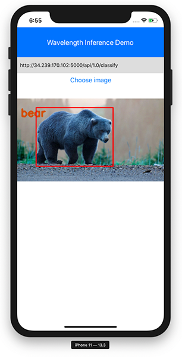

# React Native Wavelength Inference Demo



## Getting started

1. Clone the repo

```sh
git clone repo-uri
```

2. Change into the directory and install the npm dependencies

```sh
npm install

# or

yarn
```

3. Install the pods

```sh
npx pod-install
```

4. Run the app

```
npx react-native run-ios

# or

npx react-native run-android
```